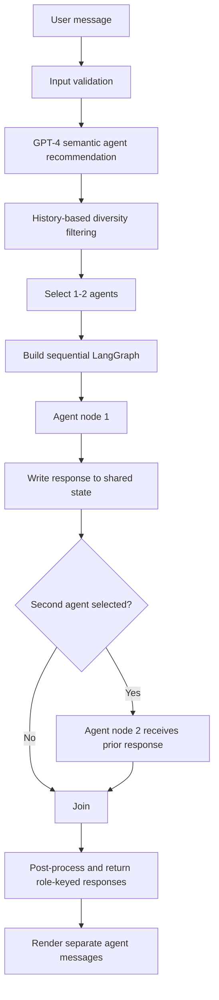

# Caring Together / Wiingle

[](https://doi.org/10.5281/zenodo.21359466)

Research artifact for the manuscript **“Caring Together: Designing a Role-Differentiated Empathic Multi-Agent System Inspired by Peer-Support Principles.”**

The manuscript is currently under review. This repository is a software and prompt artifact only; the submitted manuscript PDF is not distributed here.

This repository contains the source code, role prompts, agent-selection logic, deployment configuration, and validation tests for the role-differentiated empathic multi-agent prototype. It does **not** contain participant conversations, survey responses, interview material, application logs, or credentials.

## Artifact contents

- `app.py` — Flask application, agent roles, prompts, selection rules, and response generation
- `templates/index.html` — research-prototype interface
- `lambda_handler.py` and `template.yaml` — optional AWS SAM deployment entry point and configuration
- `tests/test_app.py` — input-validation and response-generation tests
- `docs/agent-conditions.md` — human-readable agent conditions and selection procedure
- `docs/data-and-ethics.md` — public/private artifact boundary and data-availability statement
- `docs/github-zenodo-release.md` — publication and DOI instructions

## System overview

Wiingle is a role-differentiated empathic multi-agent prototype. Instead of asking one assistant to combine every empathic strategy in a single response, it separates cognitive, emotional, and attitudinal support into independent agents and coordinates one or two of them for each user turn.

### End-to-end request flow



The browser first sends the message to `/select_agents`. The server validates the input and asks a deterministic selector call (`temperature=0`) to recommend relevant roles as a JSON array. Server-side rules then validate the names, limit the selection to two agents, and use recent `agent_history` to reduce repetitive role combinations. The browser sends the approved selection to `/get_responses`, where it is validated again rather than trusted as client input.

### Role-differentiated agents

| Agent | Primary responsibility | Characteristic response behavior |
|---|---|---|
| **Cognitive (Cogi)** | Organize thoughts and explore reasons behind feelings | Acknowledges emotion first, then gently reconstructs interpretations or thought flow without becoming prescriptive |
| **Emotional (Emo)** | Recognize and validate affect | Prioritizes emotion labeling, reflection, and acceptance rather than analysis or immediate problem solving |
| **Attitudinal (Atti)** | Encourage expression and relational continuity | Uses an open, supportive stance and an optional low-pressure question to help the user continue |

All roles share the same high-level constraints: concise one- or two-sentence output, warm informal Korean, no internal role labels, no unsupported interpretations, and no repetition of another agent's contribution. Agents must not claim personal memories, feelings, or lived experiences.

### Agent selection and diversity control

The selector combines semantic recommendation with session-level rotation rules:

1. GPT-4 proposes one or two candidate roles for the current message.
2. Unknown names and malformed suggestions are discarded.
3. Roles appearing in both of the two most recent turns are temporarily deprioritized.
4. A role appearing across three consecutive recent turns is temporarily removed.
5. If filtering removes every candidate, the system restores a valid subset so that a response is always possible.
6. The final list is deduplicated and limited to one or two known roles.

The rotation logic is intended to reduce dominance by a single role while preserving semantic relevance to the user's current message. Randomization affects role count and ordering within these constraints, so generated conversations are not expected to be textually identical across runs.

### Sequential LangGraph orchestration

For every turn, `build_graph()` constructs a graph specific to the selected roles:

```text
Start → selected agent 1 → selected agent 2 (optional) → Join
```

Each node receives the same user input and recent conversation context. After the first node runs, its role-keyed response is written to `GraphState`. The next node reads that response through `prior_responses` and is instructed to add a complementary cognitive, emotional, or relational layer rather than repeat it. This makes the implementation sequential by design; selected agents do not run in parallel.

Responses are additionally compared with `SequenceMatcher`. When lexical similarity reaches the configured threshold, the later response is regenerated up to three times. The Join node returns a single state containing the selected role outputs, which the API serializes as separate messages.

### Modular prompt architecture

The runtime prompt is assembled by `build_agent_messages()` using six manuscript-aligned modules:

| Module | Implementation |
|---|---|
| **Persona** | Korean role description defining the agent's empathic identity and tone |
| **Task Instruction** | Role-specific cognitive, emotional, or attitudinal objective |
| **N-shot Examples / Recent Context** | Up to ten recent user and assistant entries used as contextual interaction examples |
| **Input** | The current validated user message |
| **Output** | One or two complete Korean sentences in a warm, informal style |
| **Template** | Empathic acknowledgement → differentiated contribution → optional low-pressure question |

A shared guardrail explicitly prohibits fictional self-disclosure, claims of personal experience, unsolicited prescriptive advice, unsupported speculation, internal role disclosure, and duplication of peer-agent responses.

### State, storage, and privacy boundary

Short-term conversational context and agent rotation history are stored in the signed Flask session with bounded history lengths. Optional chat persistence is isolated behind `save_chat()`:

- `CHAT_STORAGE_BACKEND=disabled` is the default and makes no AWS request.
- `CHAT_STORAGE_BACKEND=dynamodb` explicitly enables persistence to the operator's configured table.
- DynamoDB records use `UserID` and a unique `MessageID`; no study dataset is bundled with this repository.

The public artifact contains no participant conversations, survey responses, interview material, AWS account identifiers, live API Gateway endpoint, author-owned S3 URL, or credentials.

### Deployment boundary

The Flask application can run locally without AWS. `lambda_handler.py` and `template.yaml` provide an optional AWS SAM deployment path using API Gateway, Lambda, and a dedicated DynamoDB table. Deploying the template creates resources only in the AWS account authenticated by the person performing the deployment. The SAM policy is scoped to the generated table rather than granting account-wide DynamoDB access.

### Reproducibility boundary

This repository reproduces the Wiingle prototype, role prompts, selection logic, orchestration, interface, and deployment configuration. It does not include the participant dataset, single-agent experimental baseline, survey administration system, statistical analysis scripts, or LIWC source responses. The generated wording can vary because response generation uses nonzero temperature and provider-hosted model behavior may change over time.

## Local setup

Requirements:

- Python 3.9
- An OpenAI API key compatible with the API version pinned in `requirements.txt`

```bash
python -m venv .venv
source .venv/bin/activate
pip install -r requirements.txt
cp .env.example .env
```

Set `OPENAI_API_KEY` and a long random `FLASK_SECRET_KEY` in `.env`, then run:

```bash
python app.py
```

Never commit `.env` or real credentials.

Chat persistence is disabled by default (`CHAT_STORAGE_BACKEND=disabled`), so a local run does not contact AWS. The interface uses repository-local image assets and does not access an author-owned S3 bucket.

## Cost and cloud-safety notice

Cloning or running this repository does not use the authors' AWS account. No author-owned AWS account ID, endpoint, access key, bucket URL, or credential is included. Users pay their own model-provider charges if they insert an API key.

AWS deployment is optional. Anyone who chooses to deploy `template.yaml` creates resources in their own authenticated AWS account and is responsible for those charges. The template uses a table-scoped DynamoDB policy rather than account-wide access. Authors should not publish a live API Gateway URL from a personally funded deployment; a public endpoint could be abused and generate Lambda, API Gateway, DynamoDB, and model-provider charges.

## Tests

```bash
OPENAI_API_KEY=test-key \
FLASK_SECRET_KEY=test-secret \
AWS_DEFAULT_REGION=ap-northeast-2 \
AWS_EC2_METADATA_DISABLED=true \
python -m unittest discover -s tests -v
```

The tests mock paid model calls and chat persistence.

## Research-data boundary

No human-participant response data are included. See `docs/data-and-ethics.md` for the repository scope and proposed Data Availability Statement.

## Citation and archival DOI

Version 1.1.0 is archived on Zenodo at [https://doi.org/10.5281/zenodo.21359466](https://doi.org/10.5281/zenodo.21359466). Use this version DOI when citing the manuscript-aligned artifact.

## License

The software and accompanying repository documentation are released under the MIT License. The license permits reuse but does not grant access to participant data, the submitted manuscript, trademarks, or third-party materials. Anyone who supplies model-provider credentials or deploys cloud infrastructure is solely responsible for charges incurred in their own accounts.
